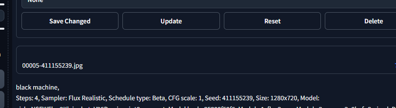
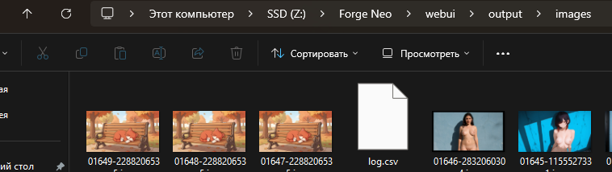

# Forge No-Copy Download

A small extension for **Stable Diffusion WebUI Forge Neo** that keeps the
standard 💾 / ZIP download workflow but prevents the download button from
permanently filling `webui/output/images` with duplicate copies.

It also preserves sequential names such as:

`00005-411155239.jpg`



## Why

Forge's normal save/download button writes a physical copy to the configured
save directory before exposing it to the browser. If you use the button often,
`output/images` can accumulate many duplicate files.

Before the extension, the save folder could keep growing with download copies:



This extension redirects browser-download files to a temporary Windows folder
and cleans older temporary files while keeping Forge-style sequential numbering.

## Features

- Keeps the normal Forge 💾 download button.
- Keeps the ZIP download button.
- Avoids permanent download copies in `webui/output/images`.
- Stores browser-download files in the OS temp directory.
- Cleans older temporary download files automatically.
- Preserves sequential Forge-style filenames:
  `00000-SEED`, `00001-SEED`, `00002-SEED`, ...
- Keeps a tiny counter file inside the extension so numbering survives temp
  cleanup and Forge restarts.
- Can migrate the counter used by the earlier core-patch version.
- Does **not** modify Forge core files on disk.

## Installation

### ZIP

1. Download this repository as ZIP.
2. Extract the folder to:

   `Forge Neo/extensions/forge-no-copy-download`

3. Fully restart Forge Neo.

### Git

```bash
cd /path/to/Forge-Neo/extensions
git clone https://github.com/YOUR_USERNAME/forge-no-copy-download.git
```

Then restart Forge Neo.

## Expected startup message

```text
[Forge Neo] forge-no-copy-download v1.0.0 loaded
```

## How it works

The extension replaces Forge's runtime `modules.ui_common.save_files`
function after Forge starts.

Files requested by the browser are created in:

```text
%TEMP%\forge-neo-download
```

instead of the permanent Forge output directory.

The current download is kept long enough for Gradio/browser download handling.
Older temporary files are removed on later saves when possible.

A tiny counter is stored as:

```text
extensions/forge-no-copy-download/.download_counter
```

This is what allows numbering to continue even though old temporary images are
deleted.

## Notes

- This changes the **manual download/save button** behavior. It does not disable
  normal generation auto-save settings in Forge or other extensions.
- The OS/browser may temporarily keep the current download file open.
- `log.csv` is kept in the temporary download directory when Forge's CSV log
  option is enabled.

## Compatibility

Designed and tested with **Forge Neo 2.29.1**.

Because this extension hooks `modules.ui_common.save_files`, future Forge Neo
changes to that function may require a compatibility update.

## Uninstall

Delete:

`extensions/forge-no-copy-download`

and fully restart Forge Neo.

## License

AGPL-3.0-or-later. See [LICENSE](LICENSE).

## Credits

Built as a compatibility/quality-of-life extension for Forge Neo's existing
save/download workflow.

Stable Diffusion WebUI Forge / Forge Neo is a separate project and is not
bundled with this repository.
